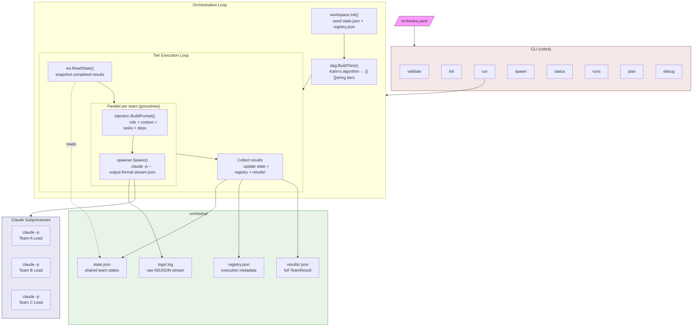
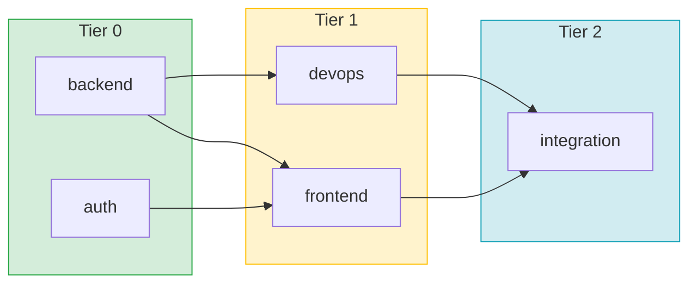
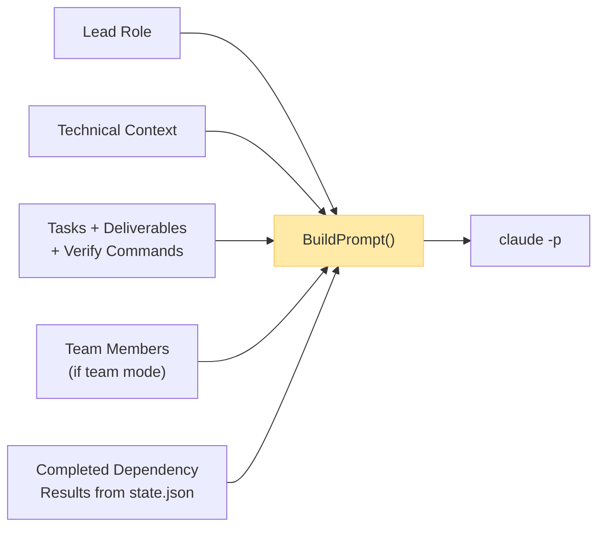

# Orchestra

A multi-team autonomous DAG workflow engine for AI agents. Define teams, tasks, and dependencies in a single `orchestra.yaml` — Orchestra builds a dependency graph, executes teams tier-by-tier (parallel within a tier, sequential across tiers), and flows results forward so downstream teams get full context of what upstream teams built.

What makes it interesting:

- **Parallel team execution** — independent teams run concurrently as separate Claude subprocesses, each with their own role, context, and tasks.
- **[Cross-team message bus](#message-bus)** — teams don't work in isolation. A file-based inbox system lets them ask questions, share interface contracts, flag blockers, and coordinate in real time.
- **Flexible coordination** — run an autonomous coordinator agent that monitors all teams, relays messages, and resolves conflicts automatically. Or be the coordinator yourself — the message bus is just files on disk, so you can read inboxes and send messages from any Claude Code session (companion skills are included to streamline this).
- **DAG-driven flow** — results from completed tiers are injected into downstream prompts, so later teams build on actual output rather than assumptions.

```
orchestra run project.yaml
```

## Architecture



### DAG Execution

Teams execute in topologically-sorted tiers. Teams within a tier run in parallel; tiers run sequentially. Results from completed tiers are injected into the prompts of downstream teams.



### Prompt Injection Flow

Each team receives a constructed prompt based on its configuration and execution context:



## Installation

```bash
# Build
make build

# Install to $GOBIN
make install
```

Requires Go 1.22+ and the [Claude CLI](https://docs.anthropic.com/en/docs/claude-code) installed.

## Quick Start

**1. Create an `orchestra.yaml`:**

```yaml
name: "my-saas-app"

defaults:
  model: sonnet
  max_turns: 200
  permission_mode: acceptEdits
  timeout_minutes: 45
  inbox_poll_interval: 5m

teams:
  - name: backend
    lead:
      role: "Backend Lead"
      model: opus
    context: |
      Go 1.22, Chi router, PostgreSQL, sqlc
    members:
      - role: "API Engineer"
        focus: "REST endpoints, request validation"
      - role: "DB Engineer"
        focus: "Postgres schema, migrations, queries"
    tasks:
      - summary: "Design and implement REST API"
        details: "Create Chi router with CRUD endpoints for users and projects"
        deliverables:
          - "src/api/router.go"
          - "src/api/handlers/"
        verify: "go build ./..."

  - name: frontend
    depends_on: [backend]
    lead:
      role: "Frontend Lead"
    context: |
      React 18, TypeScript, Tailwind CSS
    tasks:
      - summary: "Build dashboard UI"
        details: "Create React components consuming the backend API"
        deliverables:
          - "web/src/components/"
        verify: "npm run build"
```

**2. Validate:**

```bash
orchestra validate orchestra.yaml
```

**3. Preview the execution plan:**

```bash
orchestra plan orchestra.yaml
orchestra plan orchestra.yaml --show-prompts   # see full prompts
orchestra plan orchestra.yaml --json           # structured JSON output
```

**4. Run:**

```bash
orchestra run orchestra.yaml
```

## CLI Commands

| Command | Description |
|---------|-------------|
| `orchestra validate <config>` | Parse, validate, and print config summary. Exits 1 on errors. |
| `orchestra init <config>` | Validate config and create `.orchestra/` workspace directory. |
| `orchestra run <config>` | Full orchestration: build DAG, execute all tiers, print summary. |
| `orchestra spawn <config> --team <name>` | Spawn a single named team. Prints raw `TeamResult` JSON. |
| `orchestra status [--workspace <path>]` | Print workspace status table (team, status, tokens, duration). Shows summary counts, live duration for running teams, and token totals. |
| `orchestra runs ls [--workspace <path>]` | List recent active and archived workflow runs with status, cost, duration, and start time. |
| `orchestra runs show <run-id> [--workspace <path>]` | Show one run's teams, DAG tier, cached MA agent/environment IDs, and session IDs. |
| `orchestra runs prune [--workspace <path>] [--older-than 720h] [--apply] [--reconcile]` | Dry-run stale Managed Agents cache pruning in a workflow context; `--apply` deletes eligible cache records. |
| `orchestra plan <config>` | Preview DAG execution order without running anything. |
| `orchestra debug agents ls/prune` | Low-level Managed Agents cache inspection for debugging. |
| `orchestra msg --team <name> --message <text> [--no-retry]` | Steer a running managed-agents team by delivering a `user.message` to its session. See [Steering a run](#steering-a-run). |
| `orchestra interrupt --team <name>` | Send a `user.interrupt` to a running team's managed-agents session (always at-most-once). |
| `orchestra sessions ls [--all]` | List teams in the active run with their managed-agents session info. Defaults to steerable rows; `--all` includes pending / done / failed / terminated. |

### `plan` flags

| Flag | Description |
|------|-------------|
| `--show-prompts` | Print the full prompt each team would receive |
| `--json` | Emit the entire plan as structured JSON |

## Configuration Reference

### Top-level

| Field | Required | Description |
|-------|----------|-------------|
| `name` | yes | Project name |
| `defaults` | no | Default settings applied to all teams |
| `coordinator` | no | Coordinator agent settings (see below) |
| `teams` | yes | List of team definitions |

### `defaults`

| Field | Default | Description |
|-------|---------|-------------|
| `model` | `sonnet` | Claude model for all teams |
| `max_turns` | `200` | Max agentic turns per team |
| `permission_mode` | `acceptEdits` | Permission mode for claude subprocess |
| `timeout_minutes` | `30` | Timeout per team spawn |
| `inbox_poll_interval` | `5m` | How often team leads poll their inbox for messages (Go duration format, e.g. `2m`, `30s`) |
| `ma_concurrent_sessions` | `20` | Max in-flight `Beta.Sessions.New` calls under `backend: managed_agents`. Bounds the create rate against MA's 60/min org limit; ignored under `backend: local`. |

### `teams[]`

| Field | Required | Description |
|-------|----------|-------------|
| `name` | yes | Unique team identifier |
| `lead.role` | yes | Role description injected into prompt |
| `lead.model` | no | Model override for this team |
| `context` | no | Technical context injected verbatim |
| `members` | no | If present, enables team-lead mode |
| `tasks` | yes | At least one task required |
| `depends_on` | no | List of team names this team depends on |

### `teams[].members[]`

| Field | Description |
|-------|-------------|
| `role` | Member's role title |
| `focus` | What this member specializes in |

### `teams[].tasks[]`

| Field | Required | Description |
|-------|----------|-------------|
| `summary` | yes | Short task description |
| `details` | recommended | Specific requirements |
| `deliverables` | no | Expected output files/directories |
| `verify` | recommended | Shell command to confirm completion |

### `coordinator`

| Field | Default | Description |
|-------|---------|-------------|
| `enabled` | `false` | Spawn a long-lived coordinator agent alongside tier execution |
| `model` | defaults.model | Model for the coordinator |
| `max_turns` | `500` | Max turns for the coordinator session |

When enabled, the coordinator monitors team progress, relays messages between teams, resolves blocking issues, and escalates decisions to `0-human`. The coordinator's timeout scales with project size (`timeout_minutes × number_of_tiers`).

### Timeouts and force-kill

Each team has a per-spawn timeout set by `defaults.timeout_minutes`. When a team exceeds its timeout, the process is cancelled. If it doesn't exit within 60 seconds of cancellation, it is force-killed to prevent hung processes from blocking tier progression.

## Backends

Orchestra runs teams on one of two backends, selected by the top-level `backend` field. The default is `local`.

### `backend: local` (default)

Each team is a `claude -p` subprocess running on the host. The cross-team file message bus and the optional coordinator agent both live here.

### `backend: managed_agents`

Each team is a [Managed Agents](https://platform.claude.com/docs/en/managed-agents) session — a sandboxed container provisioned through the Anthropic Beta SDK. Requires `ANTHROPIC_API_KEY`. Cross-team data flows through dependency-result injection: each team's final `agent.message` is persisted under `.orchestra/results/<team>/summary.md` and inlined into downstream prompts the same way the local backend does it.

```yaml
backend:
  kind: managed_agents
defaults:
  ma_concurrent_sessions: 20  # default; cap on in-flight Beta.Sessions.New
```

A canonical multi-team example lives under [`examples/ma_multi_team/`](examples/ma_multi_team/orchestra.yaml) — a `planner` team writes an outline that the dependent `analyst` team expands. An opt-in live-MA smoke fixture lives under [`test/integration/ma_multi_team/`](test/integration/ma_multi_team/README.md).

#### Repo-backed artifacts

Teams whose deliverable is code can push to a deterministic branch instead of returning a text summary. Add a `repository` block under `backend.managed_agents`:

```yaml
backend:
  kind: managed_agents
  managed_agents:
    repository:
      url: https://github.com/your-user/your-repo
      mount_path: /workspace/repo  # default
      default_branch: main          # default
    open_pull_requests: false       # set true to also open PRs host-side
```

Per-team overrides go on `teams[i].environment_override.repository`. Orchestra resolves a GitHub PAT at startup (env `GITHUB_TOKEN` first, then `github_token` in `<user-config-dir>/orchestra/config.json`) and never persists it. Each team is told to push to `orchestra/<team>-<run-id>`; downstream teams have each upstream's pushed branch mounted read-only at `/workspace/upstream/<upstream-team>/`. After the session reaches `end_turn`, Orchestra reads the branch via the GitHub API and records a `repository_artifacts[]` entry on the team in `state.json`.

A two-team example lives under [`examples/ma_repo_relay/`](examples/ma_repo_relay/orchestra.yaml). An opt-in live-MA + GitHub fixture lives under [`test/integration/ma_repo_relay/`](test/integration/ma_repo_relay/README.md).

Caveats under `managed_agents`:

- `members:` and `coordinator:` are not supported (validation emits a warning and the orchestration ignores them).
- The file message bus is disabled — teams cannot read each other's inboxes mid-run.
- Cross-repo dependencies (downstream team in a different repo than upstream) are out of scope; the validator emits a warning and the upstream branch is not mounted.

### Steering a run

While `orchestra run` is going, three commands let a human nudge a running team without restarting the run:

```bash
orchestra sessions ls                                          # what's currently steerable
orchestra msg --team <name> --message "use the JSON store"     # deliver a user.message
orchestra interrupt --team <name>                              # deliver a user.interrupt
```

These commands talk directly to Managed Agents using the workspace's `state.json` to look up the team's session ID. The running `orchestra run` process picks up MA's echo of the steering event and logs it as `[team] human: <text>`.

Mechanics worth knowing:

- **Lock-free state read.** `msg`, `interrupt`, and `sessions ls` read `state.json` without acquiring the workspace's run lock. The atomic-write pattern keeps the snapshot consistent; the data may be stale but is never torn.
- **Targeting.** `--team` is the team name from `orchestra.yaml`. The CLI looks up its current MA session ID itself.
- **Status check.** `msg` and `interrupt` require the team to be in `running` state. The check is best-effort under TOCTOU: a team can transition between read and send, and MA's response is surfaced if that happens.
- **Retry semantics.**
  - `orchestra msg` defaults to **at-least-once with retry** on 429 / 5xx. In the rare 5xx-then-success case the agent may observe the same message twice. Pass `--no-retry` for at-most-once.
  - `orchestra interrupt` is **always at-most-once** (no retries) — duplicate interrupts could double-cancel a recovery cycle.
- **Backend gate.** All three commands require `backend: managed_agents`. Local-backend steering is tracked separately as P1.9-E.
- **No-active-run behavior.** `msg` and `interrupt` exit non-zero with `no active orchestra run in <workspace>`. `sessions ls` exits 0 with an empty table — listing is permissive.

## Message Bus

Orchestra includes a file-based message bus for cross-team communication during execution.

### Inbox conventions

Every participant gets a numbered inbox under `.orchestra/messages/`. The number prefix determines sort order and establishes two reserved slots:

| Inbox | Purpose |
|-------|---------|
| `0-human/inbox/` | Messages for the human operator. Teams send `gate` or `blocking-issue` messages here when they need a human decision. Nothing reads this inbox automatically today — it's a hook point for future human-in-the-loop workflows (approval gates, escalation policies, etc). |
| `1-coordinator/inbox/` | Messages for the coordinator agent (if enabled) or for a human acting as coordinator. The coordinator polls this inbox and responds to cross-team questions, blockers, and status updates. |
| `N-<team>/inbox/` | Per-team inboxes, numbered by tier order (e.g. `2-backend`, `3-frontend`). Teams poll their own inbox and respond to incoming messages. |

The `shared/` directory holds broadcast artifacts like interface contracts and schemas that any team can read.

### Anatomy of a message

Messages are JSON files written to a recipient's inbox. Each message has:

```json
{
  "id": "1736941800000-2-backend-interface-contract",
  "sender": "2-backend",
  "recipient": "3-frontend",
  "type": "interface-contract",
  "subject": "User API endpoints",
  "content": "GET /api/users, POST /api/users, ...",
  "reply_to": "",
  "priority": "normal",
  "timestamp": "2025-01-15T10:30:00Z",
  "read": false
}
```

`id` is auto-generated from `<timestamp_ms>-<sender>-<type>`. `reply_to` threads a response to a previous message ID. `read` is marked `true` by the recipient after processing. Teams write messages atomically (write `.tmp` then `mv`) to avoid partial reads.

### Message types

| Type | When to use |
|------|-------------|
| `bootstrap` | Seeded by orchestrator — result summaries from upstream teams |
| `question` | Need info from a parallel team |
| `answer` | Reply to a question |
| `interface-contract` | Sharing an API or interface definition |
| `status-update` | Major milestone notification |
| `blocking-issue` | Blocked and need help |
| `correction` | Course correction from coordinator or human |
| `gate` | Human-in-the-loop decision required (sent to `0-human`) |

### How it works at runtime

1. **Bootstrap** — When a team starts, the orchestrator seeds its inbox with result summaries from completed dependency teams.
2. **Inbox polling** — Each team lead starts a background cron to check their inbox periodically.
3. **Sending messages** — Teams write JSON files to the recipient's inbox directory.
4. **Clean exit** — Teams cancel their polling cron when finished so sessions exit cleanly.

### Coordinating an orchestra run

There are two ways to coordinate:

**Autonomous coordinator** — Enable `coordinator.enabled: true` in your config. A long-lived coordinator agent spawns alongside the teams, monitors all inboxes, relays messages, resolves blockers, and escalates to `0-human` when needed.

**Human-as-coordinator** — Be the coordinator yourself from a Claude Code session. Since the message bus is just files on disk, you can read and write to any inbox directly. Companion skills streamline this:

| Skill | Description |
|-------|-------------|
| `/orchestra-monitor` | Dashboard view — team status, live activity, costs, unread messages. Run with `/loop` for continuous monitoring. |
| `/orchestra-inbox` | Read messages from any inbox — summary table with expanded unread messages. |
| `/orchestra-msg` | Send a message to any team or the coordinator. |

This is often preferable to the autonomous coordinator since you can make judgment calls and course-correct in real time.

## Claude Code Skills

Orchestra ships with companion [Claude Code skills](https://docs.anthropic.com/en/docs/claude-code) in `.claude/skills/` that are automatically available when you open the project in Claude Code. These are especially useful when acting as a human coordinator during a run.

| Skill | Description |
|-------|-------------|
| `/orchestra-coord` | Bootstrap a Claude Code session as the human coordinator — reads config, shows status, starts a monitor loop, and primes the session for interventions. |
| `/orchestra-init` | Interactively generate an `orchestra.yaml` from a short conversation about your project. |
| `/orchestra-monitor` | Single-pass status dashboard — team progress, costs, live activity, unread messages. Designed to run with `/loop` for continuous monitoring. |
| `/orchestra-inbox` | Read messages from any inbox — summary table with expanded unread messages. |
| `/orchestra-msg` | Send a message to any team, the coordinator, or broadcast to all teams. |

## Solo vs Team Mode

A team's mode is determined by the presence of `members`:

- **Solo mode** (no `members`): The lead agent works through all tasks directly, runs verify commands, and produces a summary.
- **Team-lead mode** (`members` present): The lead uses `TeamCreate` to spawn teammates, assigns 2-6 tasks each, runs them in parallel, verifies results, and iterates if needed.

## Validation

Orchestra performs two levels of validation:

**Hard errors** (block execution):
- Empty project name or team names
- No teams or no tasks defined
- Duplicate team names
- `depends_on` referencing nonexistent teams
- Self-dependencies
- Dependency cycles (detected via DFS)

**Soft warnings** (printed but don't block):
- Team has > 5 members
- Task/member ratio outside [2, 8]
- Task missing `details` or `verify`

## Workspace

Running `orchestra run` creates an `.orchestra/` directory:

```
.orchestra/
├── state.json          # Shared state: per-team status, results, token counts, duration
├── registry.json       # Execution metadata: PIDs, session IDs, timestamps, live status
├── coordinator/        # Coordinator decisions log (if enabled)
├── results/
│   └── <team>.json     # Full TeamResult per completed team
├── logs/
│   └── <team>.log      # Raw NDJSON stream from claude subprocess
├── archive/
│   └── <run-id>/       # Prior active run state, results, logs, messages
└── messages/
    ├── 0-human/inbox/  # Messages for the human operator
    ├── 1-coordinator/  # Messages for the coordinator agent
    ├── N-<team>/inbox/ # Per-team inboxes
    └── shared/         # Broadcast artifacts
```

All writes are atomic (write to `.tmp`, then `os.Rename`). Concurrent access within a single `orchestra run` process is protected by a mutex.

## Development

```bash
make build       # Build binary
make test        # Run tests
make vet         # Run go vet
make clean       # Remove binary
make install     # Build + install to $GOBIN
make uninstall   # Remove from $GOBIN
```

### Testing

```bash
go test ./...          # Unit + integration tests
go test -race ./...    # With race detector
go test -v ./e2e_test.go  # End-to-end tests only
```

The test suite covers config, DAG, injection, spawner, and workspace packages with unit tests, plus end-to-end tests that build the real binary and use a mock `claude` script emitting valid stream-json.

The spawner is tested without mocks or interfaces — `SpawnOpts.Command` points at a shell script that emits realistic NDJSON, exercising the real code path.

## Dependencies

| Package | Purpose |
|---------|---------|
| [cobra](https://github.com/spf13/cobra) | CLI framework |
| [yaml.v3](https://gopkg.in/yaml.v3) | YAML config parsing |
| [color](https://github.com/fatih/color) | Colored terminal output |

## License

MIT
