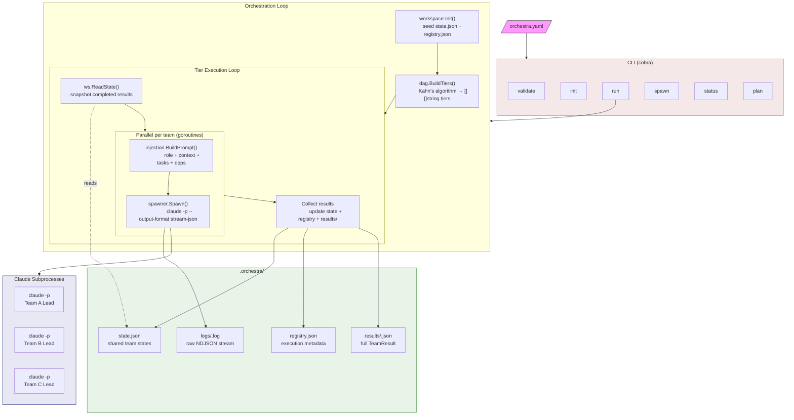
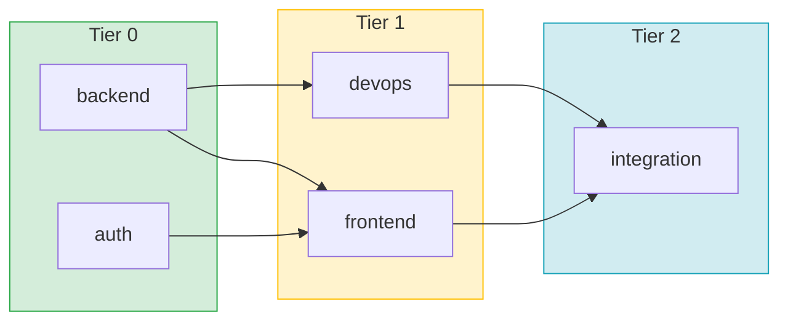
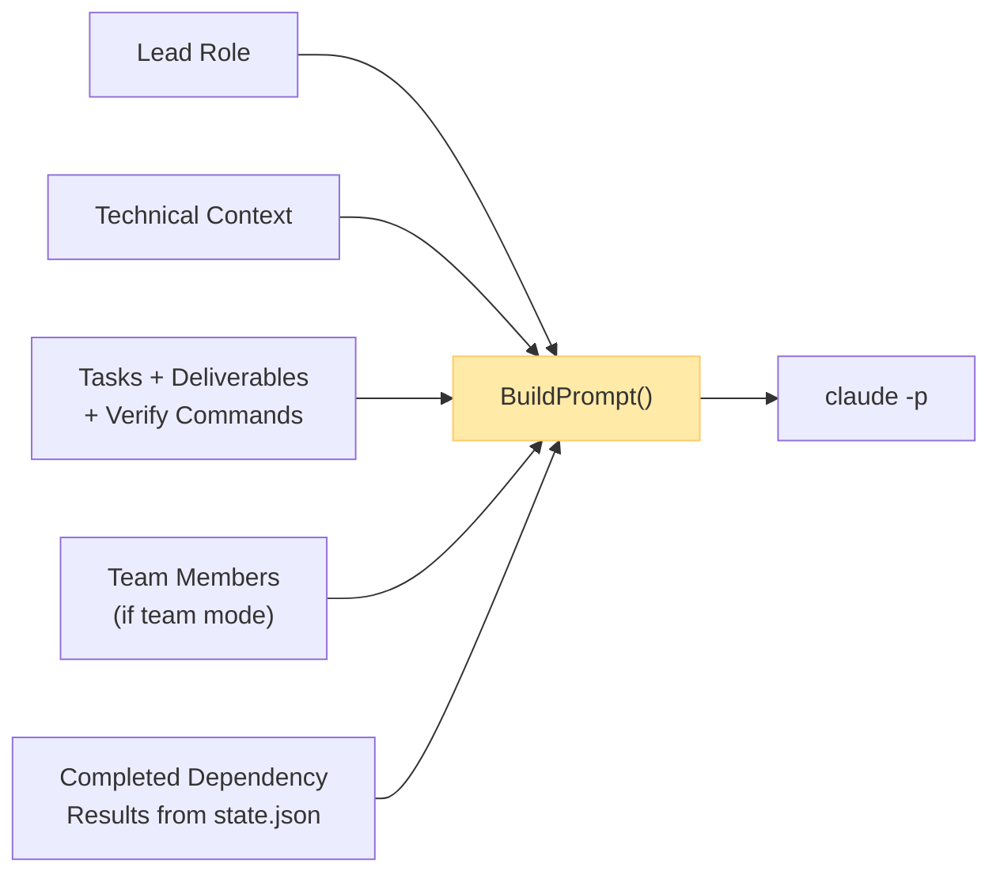

# Orchestra

A Go CLI that orchestrates large software projects across multiple AI agent teams. Describe your teams, tasks, and dependencies in a single `orchestra.yaml`, then run `orchestra run`. It builds a DAG, executes teams tier-by-tier (parallel within a tier, sequential across tiers), and flows results forward so later teams get full context of what earlier teams built.

```
orchestra run project.yaml
```

## Architecture



### DAG Execution

Teams execute in topologically-sorted tiers. Teams within a tier run in parallel; tiers run sequentially. Results from completed tiers are injected into the prompts of downstream teams.



### Prompt Injection Flow

Each team receives a constructed prompt based on its configuration and execution context:



## Installation

```bash
# Build
make build

# Install to $GOBIN
make install
```

Requires Go 1.22+ and the [Claude CLI](https://docs.anthropic.com/en/docs/claude-code) installed.

## Quick Start

**1. Create an `orchestra.yaml`:**

```yaml
name: "my-saas-app"

defaults:
  model: sonnet
  max_turns: 200
  permission_mode: acceptEdits
  timeout_minutes: 45

teams:
  - name: backend
    lead:
      role: "Backend Lead"
      model: opus
    context: |
      Go 1.22, Chi router, PostgreSQL, sqlc
    members:
      - role: "API Engineer"
        focus: "REST endpoints, request validation"
      - role: "DB Engineer"
        focus: "Postgres schema, migrations, queries"
    tasks:
      - summary: "Design and implement REST API"
        details: "Create Chi router with CRUD endpoints for users and projects"
        deliverables:
          - "src/api/router.go"
          - "src/api/handlers/"
        verify: "go build ./..."

  - name: frontend
    depends_on: [backend]
    lead:
      role: "Frontend Lead"
    context: |
      React 18, TypeScript, Tailwind CSS
    tasks:
      - summary: "Build dashboard UI"
        details: "Create React components consuming the backend API"
        deliverables:
          - "web/src/components/"
        verify: "npm run build"
```

**2. Validate:**

```bash
orchestra validate orchestra.yaml
```

**3. Preview the execution plan:**

```bash
orchestra plan orchestra.yaml
orchestra plan orchestra.yaml --show-prompts   # see full prompts
orchestra plan orchestra.yaml --json           # structured JSON output
```

**4. Run:**

```bash
orchestra run orchestra.yaml
```

## CLI Commands

| Command | Description |
|---------|-------------|
| `orchestra validate <config>` | Parse, validate, and print config summary. Exits 1 on errors. |
| `orchestra init <config>` | Validate config and create `.orchestra/` workspace directory. |
| `orchestra run <config>` | Full orchestration: build DAG, execute all tiers, print summary. |
| `orchestra spawn <config> --team <name>` | Spawn a single named team. Prints raw `TeamResult` JSON. |
| `orchestra status [--workspace <path>]` | Print workspace status table (team, status, cost, duration). |
| `orchestra plan <config>` | Preview DAG execution order without running anything. |

### `plan` flags

| Flag | Description |
|------|-------------|
| `--show-prompts` | Print the full prompt each team would receive |
| `--json` | Emit the entire plan as structured JSON |

## Configuration Reference

### Top-level

| Field | Required | Description |
|-------|----------|-------------|
| `name` | yes | Project name |
| `defaults` | no | Default settings applied to all teams |
| `teams` | yes | List of team definitions |

### `defaults`

| Field | Default | Description |
|-------|---------|-------------|
| `model` | `sonnet` | Claude model for all teams |
| `max_turns` | `200` | Max agentic turns per team |
| `permission_mode` | `acceptEdits` | Permission mode for claude subprocess |
| `timeout_minutes` | `30` | Timeout per team spawn |

### `teams[]`

| Field | Required | Description |
|-------|----------|-------------|
| `name` | yes | Unique team identifier |
| `lead.role` | yes | Role description injected into prompt |
| `lead.model` | no | Model override for this team |
| `context` | no | Technical context injected verbatim |
| `members` | no | If present, enables team-lead mode |
| `tasks` | yes | At least one task required |
| `depends_on` | no | List of team names this team depends on |

### `teams[].members[]`

| Field | Description |
|-------|-------------|
| `role` | Member's role title |
| `focus` | What this member specializes in |

### `teams[].tasks[]`

| Field | Required | Description |
|-------|----------|-------------|
| `summary` | yes | Short task description |
| `details` | recommended | Specific requirements |
| `deliverables` | no | Expected output files/directories |
| `verify` | recommended | Shell command to confirm completion |

### `coordinator`

| Field | Default | Description |
|-------|---------|-------------|
| `enabled` | `false` | Spawn a long-lived coordinator agent alongside tier execution |
| `model` | defaults.model | Model for the coordinator |
| `max_turns` | `500` | Max turns for the coordinator session |

When enabled, the coordinator monitors team progress, relays messages between teams, resolves blocking issues, and escalates decisions to `0-human`.

## Message Bus

Orchestra includes a file-based message bus for cross-team communication. Each team gets an inbox at `.orchestra/messages/<N>-<team>/inbox/`. Special inboxes:

- `0-human` — messages directed at the human operator
- `1-coordinator` — messages for the coordinator agent

### How it works

1. **Inbox polling** — Each team lead starts a `/loop 1m` cron to check their inbox every minute.
2. **Sending messages** — Teams write JSON files to the recipient's inbox using atomic writes (write `.tmp` then `mv`).
3. **Bootstrap messages** — When a team starts, the orchestrator seeds its inbox with result summaries from completed dependency teams (message type `bootstrap`).
4. **Clean exit** — Teams cancel their `/loop` via `CronDelete` when finished so sessions exit cleanly.

### Message types

| Type | When to use |
|------|-------------|
| `bootstrap` | Seeded by orchestrator — results from upstream teams |
| `question` | Need info from a parallel team |
| `answer` | Reply to a question |
| `interface-contract` | Sharing an API or interface definition |
| `status-update` | Major milestone notification |
| `blocking-issue` | Blocked and need help |
| `correction` | Course correction from coordinator or human |
| `gate` | Human-in-the-loop decision required |

### Workspace structure with messaging

```
.orchestra/
├── state.json
├── registry.json
├── results/<team>.json
├── logs/<team>.log
└── messages/
    ├── 0-human/inbox/
    ├── 1-coordinator/inbox/
    ├── 2-<team-a>/inbox/
    ├── 3-<team-b>/inbox/
    └── shared/              # Broadcast artifacts (interface contracts, schemas)
```

### Human-as-Coordinator via Claude Code

You can act as the coordinator yourself from a Claude Code session. Teams send messages to `1-coordinator` and `0-human` — a Claude Code session with the right skills can monitor both inboxes, read messages, and respond in real-time. This is often preferable to enabling the automated coordinator, since you can make judgment calls, answer questions, and course-correct teams as they work.

The workflow:

1. Start the orchestra run (in background or a separate terminal)
2. In your Claude Code session, run `/loop 3m /orchestra-monitor` to get periodic status updates with team activity, costs, and unread messages
3. When a message arrives in `1-coordinator` or `0-human`, use `/orchestra-inbox` to read it
4. Respond with `/orchestra-msg` — answer questions, broadcast decisions, or send corrections to specific teams

Available skills:

| Skill | Description |
|-------|-------------|
| `/orchestra-monitor` | Dashboard view — team status, live activity, costs, unread messages. Use with `/loop` for continuous monitoring. |
| `/orchestra-inbox` | Read messages from any inbox — shows summary table, expands unread messages. |
| `/orchestra-msg` | Send a message to any team or the coordinator. |

## Solo vs Team Mode

A team's mode is determined by the presence of `members`:

- **Solo mode** (no `members`): The lead agent works through all tasks directly, runs verify commands, and produces a summary.
- **Team-lead mode** (`members` present): The lead uses `TeamCreate` to spawn teammates, assigns 2-6 tasks each, runs them in parallel, verifies results, and iterates if needed.

## Validation

Orchestra performs two levels of validation:

**Hard errors** (block execution):
- Empty project name or team names
- No teams or no tasks defined
- Duplicate team names
- `depends_on` referencing nonexistent teams
- Self-dependencies
- Dependency cycles (detected via DFS)

**Soft warnings** (printed but don't block):
- Team has > 5 members
- Task/member ratio outside [2, 8]
- Task missing `details` or `verify`

## Workspace

Running `orchestra run` creates an `.orchestra/` directory:

```
.orchestra/
├── state.json          # Shared state: per-team status, results, artifacts, cost
├── registry.json       # Execution metadata: PIDs, session IDs, timestamps
├── coordinator/        # Coordinator decisions log (if enabled)
├── results/
│   └── <team>.json     # Full TeamResult per completed team
├── logs/
│   └── <team>.log      # Raw NDJSON stream from claude subprocess
└── messages/
    ├── 0-human/inbox/  # Messages for the human operator
    ├── 1-coordinator/  # Messages for the coordinator agent
    ├── N-<team>/inbox/ # Per-team inboxes
    └── shared/         # Broadcast artifacts
```

All writes are atomic (write to `.tmp`, then `os.Rename`). Concurrent access within a single `orchestra run` process is protected by a mutex.

## Development

```bash
make build       # Build binary
make test        # Run tests
make vet         # Run go vet
make clean       # Remove binary
make install     # Build + install to $GOBIN
make uninstall   # Remove from $GOBIN
```

### Testing

```bash
go test ./...          # Unit + integration tests
go test -race ./...    # With race detector
go test -v ./e2e_test.go  # End-to-end tests only
```

The test suite includes:
- **46 unit tests** across config, DAG, injection, spawner, and workspace packages
- **2 end-to-end tests** that build the real binary and use a mock `claude` script emitting valid stream-json

The spawner is tested without mocks or interfaces — `SpawnOpts.Command` points at a shell script that emits realistic NDJSON, exercising the real code path.

## Dependencies

| Package | Purpose |
|---------|---------|
| [cobra](https://github.com/spf13/cobra) | CLI framework |
| [yaml.v3](https://gopkg.in/yaml.v3) | YAML config parsing |
| [color](https://github.com/fatih/color) | Colored terminal output |

## License

MIT
